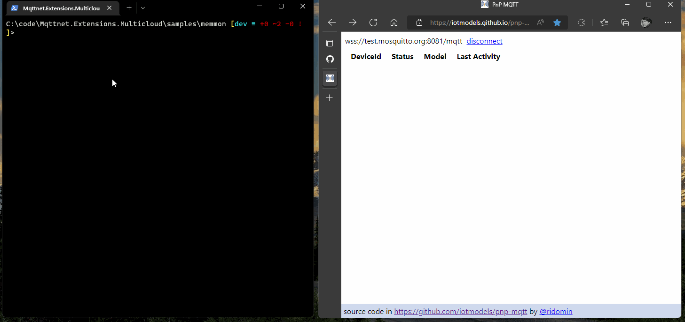

# MQTTnet.Extensions.MultiCloud

:rocket: Create MQTT devices compatible with any MQTT Cloud provider, such as **Azure IoT**, **AWS IoT Core**, **Hive MQ**, **CloudFlare** or even **Mosquitto**.

[](https://www.nuget.org/packages/MQTTnet.Extensions.MultiCloud.AzureIoTClient)
[](https://www.nuget.org/packages/MQTTnet.Extensions.MultiCloud.BrokerIoTClient)
[](https://www.nuget.org/packages/MQTTnet.Extensions.MultiCloud.AwsIoTClient)

[](https://github.com/ridomin/MQTTnet.Extensions.MultiCloud/actions/workflows/ci.yml)
[](https://github.com/ridomin/MQTTnet.Extensions.MultiCloud/actions/workflows/ci.yml)

> Note: Pre-Release versions can be found in MyGet: https://www.myget.org/F/ridopackages/api/v3/index.json


## QuickStarts

### Using `test.mosquitto.org`

- Navigate to the Memmory Monitor sample in `samples/memmon` and run with `dotnet run` or in Visual Studio hit `F5`. It's configured to connect tp `test.mosquitto.org:8886` (encrypted/no auth), 
- Browse to [https://iotmodels.github.io/pnp-mqtt](https://iotmodels.github.io/pnp-mqtt) and connect to `test.mosquitto.org:8081` (websockets, encrypted/no auth)
- You should see a list of devices, select a device matching your machine name. Invoke the command, or change a property. The console application should show those changes.



> Same sample can be executed with a local mosquitto server, this project uses [mosquitto-local](https://github.com/ridomin/mosquitto-local)

### Using `Azure IoT Central`

- Create a new IoT Central application
- Create a new device template importing the Memory Monitor interface: [samples/memmon/dtmi_rido_pnp_memmon-1.json](/memmon/dtmi_rido_pnp_memmon-1.json), customize the Views an Publish the template.
- Create a new Device Identity, select `Connect` to get the IdScope, DeviceID and Key 
- Start the application with `dotnet run /ConnectionStrings:cs="IdScope=<dps-id-scope>;DeviceId=<deviceId>;SharedAccessKey=<deviceSasKey>"
- Interact with the device from the Central application.

### Create your own device

1. Define your device interactions using the [DTDL](https://aka.ms/dtdl) language. Like this [DTDL interface](samples/memmon/dtmi_rido_pnp_memmon-1.json)
2. Create the base libraries to implement the DTDL interface for each cloud vendor. See the [Memory Monitor sample](samples/memmon/dtmi_rido_pnp_memmon-1.g.cs)
3. Implement the device logic, in a way that can be reused across different cloud vendor implementations. [Device Logic](samples/memmon/Device.cs)
4. Connect the device using different [Connection Settings](docs/ConnectionSettings.md)
5. Interact with the device with a DTDL enabled solution. Like [Azure IoT Central](https://www.azureiotcentral.com), [IoTExplorer](https://docs.microsoft.com/en-us/azure/iot-fundamentals/howto-use-iot-explorer) or [Pnp-Mqtt](https://iotmodels.github.io/pnp-mqtt/)


## TL;DR;

Any MQTT solution will have at least two parts: Devices and Solutions to interact with those devices.. 

This repo focuses on the first part: how to implement things/devices that can work with any cloud vendor supporting a MQTT service. 


1. Connect the devices to the endpoint in a secure way, this can be done by using TLS with Basic-Auth-Credentials or X509 client certificates.

2. Describe the _interaction patterns_ (basically Pub/Sub) in a way that can be implemented for different cloud vendors, these interaction patterns consist of:
   - Telemetry. Ephimeral data sent by device sensors, eg. the device temperature.
   - Properties. To manage the device state, sometimes it's reported by the device and can also be managed from the Solution. eg How often the telemetry must be sent.
   - Commands. To invoke specific actions. 

3. Enable solutions to reflect those _interaction patterns_ to create UI experiences, IoT Central, IoTExplorer or PnP-MQTT are examples of PnP enabled solutions.


## ConnectionSettings

To simplify the connection, there is a `ConnectionSettings` class that can be configured with a connection string based on Key/Value pairs. 

```cs
// connect to iot hub with Sas Key
var cs = HostName=<hubName>.azure-devices.net;DeviceId=<deviceId>;SharedAccessKey=<deviceSasKey>;
var client = await  HubDpsFactory.CreateFromConnectionSettingsAsync(cs); 
```

```cs
// connect to mosquitto with client certificate
var cs = HostName=test.mosquitto.org;TcpPort=8884;ClientId=<clientId>;X509Key=<cert.pem>|<cert.key>;
var client = await  BrokerClientFactory.CreateFromConnectionSettingsAsync(cs); 
```


See [ConnectionSettings docs](docs/ConnectionSettings.md) for full reference.

### MqttClientOptionsBuilder extensions

The connection settings are used by the `.WithConnectionSettings` MqttClientOptionsBuilder extension, including:

- Azure IoT Hub Shared Access Keys (for device and module Identities)
- Azure IoT Hub Shared X509 Certificates(for device and module Identities)
- Azure IoT DPS Shared Access Keys
- Azure IoT DPS Shared X509 Certificates
- AWS IoT Client X509 Certificates
- MQTT Username/Password with or without TLS
- TLS Supoport for private CA 
- TLS Supoport for private CA and Client Certificates

## AzureIoTClient

This library implements the default Azure IoT Hub primitives: Provsioning through DPS, Authentication, Telemetry, Property and Commands, see [IoTHubClient sample](./samples/iothub-client/Device.cs) for a full API refernce

Connecting to Iot Hub (with or without DPS)

```cs
var connectionString = "HostName=<hubName>.azure-devices.net;DeviceId=<deviceId>;SharedAccessKey=<deviceSasKey>"
var client = new HubMqttClient(await HubDpsFactory.CreateFromConnectionSettingsAsync(connectionString));
```

Sending Telemetry events:

```cs
var puback = await client.SendTelemetryAsync(new { workingSet = Environment.WorkingSet });
```

Read and Update the Device Twin:

```cs
var twin = await client.GetTwinAsync(stoppingToken);
var version = await client.ReportPropertyAsync(new { started = DateTime.Now });
```

Properties Updates (aka Writable Properties) handling:

```cs
client.OnPropertyUpdateReceived = async m =>
{
      return await Task.FromResult(new GenericPropertyAck
      {
         Value = m.ToJsonString(),
         Status = 200,
         Version = m["$version"].GetValue<int>()
      });
};
```

DirectMethods are available as Command Delegates:

```cs
client.OnCommandReceived = async m =>
{
   return await Task.FromResult(new CommandResponse()
   {
      Status = 200,
      ReponsePayload = JsonSerializer.Serialize(new { myResponse = "whatever" })
   });
};
```

> Note: This library also supports the Device Provisioning Service by providing the `IdScope` in the connection settings.

## DTDL interfaces

When using a typed interface, there are APIs to create APIs to interact with the broker, based on the DTDL language. Enabling  Solutions such as Azure IoT Central, see [MemoryMonitor sample](./samples/memmon/Device.cs)

Memory Monitor interface

```json
{
  "@context": "dtmi:dtdl:context;2",
  "@id": "dtmi:rido:pnp:memmon;1",
  "@type": "Interface",
  "contents": [
    
    {
      "@type": ["Property", "TimeSpan"],
      "name": "interval",
      "schema": "integer",
      "writable": true,
      "unit": "second"
    },
    {
      "@type": ["Telemetry", "DataSize"],
      "name": "workingSet",
      "schema": "double",
      "unit": "byte"
    }
}
```

Can be represented in C# as

```cs
public interface Imemmon 
{
    public const string ModelId = "dtmi:rido:pnp:memmon;1";
    public IMqttClient Connection { get; }
    public IWritableProperty<int> Property_interval { get; set; }
    public ITelemetry<double> Telemetry_workingSet { get; set; }
}
```

The `Imemmon` interface is implemented for Azure, AWS and Hive.

### X509 Support

- CA certificates can be provided in `PEM` or `CER` format to intilize the TLS connection
- Client certificates, including the private key, can be provided by PFX files (with password), or by querying the Certificate Store `CurrentUser\My` by `thumbrpint`, see [Connecting with Certificates](docs/X509Certificates.md) for more details.


